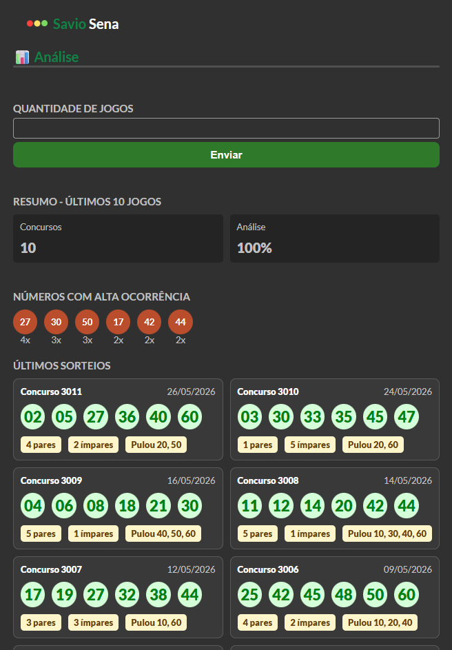

# 🍀 Mega Sena — Savio Sena

> Ferramenta web para análise de resultados e geração de jogos da Mega Sena, criada com carinho para meu pai, **Savio**.

👉 [Acesse clicando aqui] (https://pierry-savio.github.io/savio-sena/) 🔗

---

## 📌 Sobre o projeto

Esta aplicação web permite acompanhar os últimos sorteios da Mega Sena, identificar os números que mais saíram e gerar novos jogos com base em filtros personalizados — tudo isso de forma simples, rápida e direto no navegador, sem precisar instalar nada.

---

## ✨ Funcionalidades

### 📊 Análise
- Consulta os **últimos N sorteios** da Mega Sena (quantidade definida pelo usuário)
- Exibe os **6 números com maior ocorrência** no período analisado
- Lista os concursos recentes com:
  - Número do concurso e data
  - Os 6 dezenas sorteadas
  - Quantidade de pares e ímpares por jogo
  - Dezenas que foram "puladas" (sem nenhum número sorteado)

### 🎲 Geração de Jogos
- Gera **múltiplos jogos** de uma vez (quantidade configurável)
- Controle de **quantidade de pares e ímpares** por jogo
- **Pular números individuais** — marque os números que não devem aparecer nos jogos gerados
- **Pular dezenas inteiras** — bloqueie faixas como 01–10, 11–20, etc.
- Validação automática: alerta se a combinação escolhida for impossível de gerar

---

## 🛠️ Tecnologias

| Tecnologia | Uso |
|---|---|
| HTML5 | Estrutura da página |
| CSS3 | Estilização e responsividade |
| JavaScript (Vanilla) | Lógica de análise e geração de jogos |
| [Loterias Caixa API](https://loteriascaixa-api.herokuapp.com) | Dados dos sorteios oficiais |

---

## 📱 Responsividade

O layout foi desenvolvido para funcionar bem tanto em **dispositivos móveis** quanto em **desktops**. Em modo paisagem (*landscape*), alguns elementos se reorganizam em grade para melhor aproveitamento do espaço.

---

## 🤝 Créditos

Este projeto foi criado com a [loterais-api](https://github.com/guto-alves/loterias-api) de [@guto-alves](https://github.com/guto-alves). 🎰
